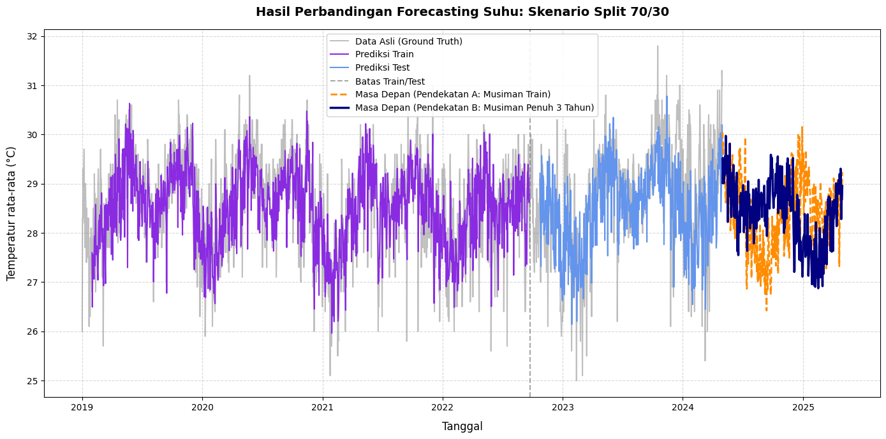

# 🌡️ Temperature Forecasting Using STL Decomposition and LSTM

[](https://www.python.org/)
[](https://tensorflow.org)
[](https://scikit-learn.org/)
[]()

## Project Overview

This project forecasts daily air temperatures using a hybrid time-series forecasting framework that combines **Seasonal-Trend Decomposition (STL)** with **Long Short-Term Memory (LSTM)** neural networks.

The forecasting pipeline separates seasonal patterns from the underlying temperature trend before training. The LSTM model learns only the deseasonalized trend component, while seasonal effects are reintroduced during reconstruction and future forecasting.

The final system supports long-term forecasting up to **365 days ahead** and evaluates multiple train/test split configurations to identify the most robust forecasting model.

---

## Dataset

The dataset was obtained from **BMKG Stasiun Meteorologi Kemayoran** and is included in this repository as `weather_data.csv`.

### Features

| Column | Description |
|----------|-------------|
| `Tanggal` | Observation date (`YYYY-MM-DD`) |
| `Temperatur rata-rata (°C)` | Daily average temperature in Celsius |

---

## Methodology

The forecasting pipeline consists of four main stages:

### 1. Exploratory Data Analysis (EDA)

Historical temperature trends are analyzed through yearly, monthly, and daily visualizations.

### 2. Seasonal Decomposition

Multiplicative decomposition (`period = 365`) is applied to separate:

- Trend
- Seasonal component
- Residual noise

Only the deseasonalized trend component is used for model training.

### 3. Data Scaling and Windowing

The trend component is normalized using `MinMaxScaler` and transformed into sequential samples using a sliding window:

```python
look_back = 30
```

### 4. LSTM Forecasting

An LSTM neural network is trained to learn long-term temperature dynamics and generate future predictions.

---

## Key Technical Features

- Modular helper-function architecture for preprocessing, training, forecasting, and visualization.
- Leakage-free seasonal decomposition performed independently within each training split.
- Independent model initialization for every experiment to prevent weight carry-over between evaluation scenarios.
- Automated evaluation of multiple train/test split configurations (**80/20**, **70/30**, and **60/40**).
- Recursive forecasting for 365-day future temperature prediction.
- Comparative evaluation of alternative seasonality reconstruction strategies.

---

## Model Performance

### Final Results

| Scenario | Train MSE | Test MSE | Train MAE | Test MAE | Train MAPE | Test MAPE |
|:---:|:---:|:---:|:---:|:---:|:---:|:---:|
| 80/20 | 0.5121 | 1.1641 | 0.5677 | 0.8653 | 1.99% | 2.96% |
| **70/30** | **0.4487** | **0.9648** | **0.5141** | **0.7676** | **1.80%** | **2.67%** |
| 60/40 | 0.4557 | 1.1529 | 0.5148 | 0.8312 | 1.81% | 2.91% |

### Best Model

The **70/30 train-test split** achieved the best overall performance:

- **Test MAPE:** 2.67%
- **Test MAE:** 0.7676°C
- **Test MSE:** 0.9648

---

## Experimental Improvement

During development, a critical evaluation issue was identified where multiple train/test split scenarios were trained sequentially on the same Keras model instance.

The pipeline was refactored so that each experimental scenario initializes a fresh LSTM model before training:

```python
for scenario in scenarios:
    model = build_lstm_model()
    model.fit(...)
```

This guarantees independent training across experiments and prevents weight carry-over between scenarios.

### Performance Comparison

| Metric | Original Best Model | Improved Best Model |
|----------|----------|----------|
| Test MSE | 1.39 | 0.96 |
| Test MAE | 0.91°C | 0.77°C |
| Test MAPE | 3.00% | 2.67% |

This refactoring improved both experimental reliability and forecasting performance.

---

## Future Forecasting Strategy

Two approaches were evaluated for future seasonality reconstruction:

### Approach A: Training Season Projection

Uses seasonal patterns extracted exclusively from the training partition.

### Approach B: Global Seasonal Projection (Recommended)

Uses seasonality estimated from the complete historical timeline.

Approach B was selected as the final forecasting strategy because it preserves seasonal phase alignment more accurately and produces forecasts that better reflect real-world annual temperature cycles.

### Prediction Result



---

## How to Run Locally

### 1. Clone the Repository

```bash
git clone https://github.com/yourusername/temperature-forecasting.git
cd temperature-forecasting
```

### 2. Set Up a Virtual Environment

#### Windows

```bash
python -m venv venv
.\venv\Scripts\activate
```

#### macOS/Linux

```bash
python3 -m venv venv
source venv/bin/activate
```

### 3. Install Dependencies

```bash
pip install -r requirements.txt
```

### 4. Run the Notebook

```bash
jupyter notebook Final_Forecasting_Pipeline.ipynb
```

---

## Technical Contributions

The final forecasting pipeline was refactored and optimized by **Shabrina Nur Ihsani**.

Key contributions include:

- Refactoring the forecasting workflow into modular helper functions.
- Designing automated multi-scenario evaluation pipelines.
- Eliminating model weight carry-over between experiments through independent model initialization.
- Improving forecasting performance, resulting in a best model achieving **2.67% Test MAPE**.

---

## Credits

This project was developed as a Final Project assignment at **Institut Teknologi Sepuluh Nopember (ITS)**.

### Group 3

- **Shabrina Nur Ihsani**
- **Nailah Azzahra**
- **Kayla Kirani Kusnadi**
